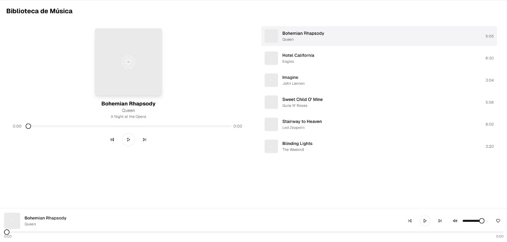
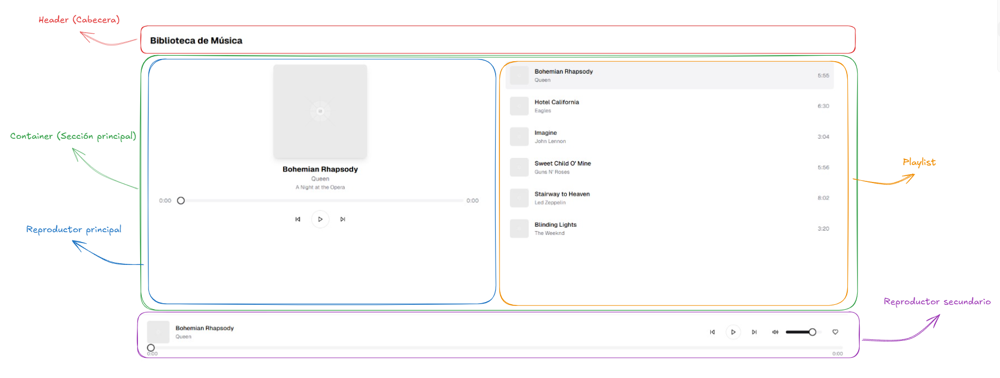

##### Inspiración

#### Paso 1: Armar estructura base:
Usa elementos de HTML para armar la siguiente estructura:

(Sin el contenido, solo deja los rectangulos con el nombre del contenedor y los bordes de diferente color para diferenciar).

#### Paso 2: Juntar canciones y fotos:
Descarga al menos 15 canciones y su foto de portada.

#### Paso 3: Contenido de relleno:
Completa los datos en el reproductor primario y secundario con los datos de una canción.
En la sección de playlist armar una lista con los datos de las demas canciones descargadas.

